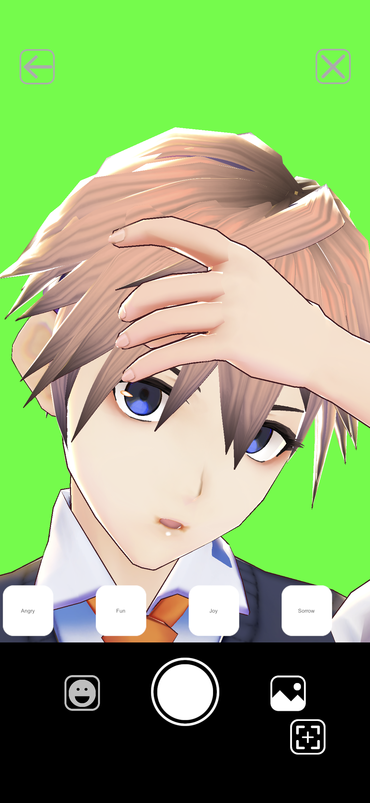

## Emosign
- 誰でも簡単にモーショントラッキングを利用したアバター表示を行うことができるアプリです．
- 表情と両手の認識を行うことでアバターを操作することができます．
- 現在はTrueDepthカメラを搭載したiOSデバイス単体でモデルの表示と操作が行えます．

|

{:height="100%" width="100%"}

## 実行環境
Apple製のTrueDepthカメラ搭載のiOSデバイス
- [ ] iPhone 11 Pro Max
- [ ] iPhone 11 Pro
- [ ] iPhone 11
- [ ] iPhone XS Max
- [x] iPhone XS
- [ ] iPhone XR
- [ ] iPhone X
- [ ] iPad Pro 12.9 インチ (第 4 世代)
- [ ] iPad Pro 12.9 インチ (第 3 世代)
- [ ] iPad Pro 11 インチ (第 2 世代)
- [ ] iPad Pro 11 インチ
- [x] 動作確認済み

[参考ページ](https://support.apple.com/ja-jp/HT209183)

## 機能紹介
### VRMモデル対応
VRMフォーマットの3Dモデルに対応しています．

[VRMフォーマットについて](https://vrm.dev/)

### 表情認識対応
TrueDepthカメラを利用した表情認識を行いアバターに反映させることができます．

### ハンドトラッキング対応
画像処理による指を含めた両手のトラッキングをアバターに反映させることができます．

## 使い方
[Emosignの利用開始方法](https://youtu.be/HYjYt9sq6Bs)

[Emosignのモデル操作方法](https://youtu.be/pCm51vZ1Lkg)

[EmosignのVRMモデル追加方法](https://youtu.be/HZv-hvIA7XU)

<iframe width="560" height="315" src="https://www.youtube.com/embed/HZv-hvIA7XU" frameborder="0" allow="accelerometer; autoplay; encrypted-media; gyroscope; picture-in-picture" allowfullscreen></iframe>

## ライセンス
[ライセンスの詳細についてはこちら](https://akihiro0105.github.io/EmosignLicensePage/)

## TestFlight
現在Emosignはテスト段階でありTestFlightでのテスターを募集しています．
iOSデバイスで以下のリンクにアクセスしてEmosignをテストしてください．

[TestFlightに参加する]()

## 今後の予定
- [ ] AppStoreでのリリース
- [ ] Windows/Mac連携アプリ
- [ ] TureDepthカメラ未対応デバイス対応

## お問い合わせ
- [お問い合わせページ](https://docs.google.com/forms/d/e/1FAIpQLSeM6epPLYCkLF4ngk_GQKEzkqP9Fn1FzsuyhnKS3RJylz_Klg/viewform)
- [Twitter](https://twitter.com/akihiro01051)
